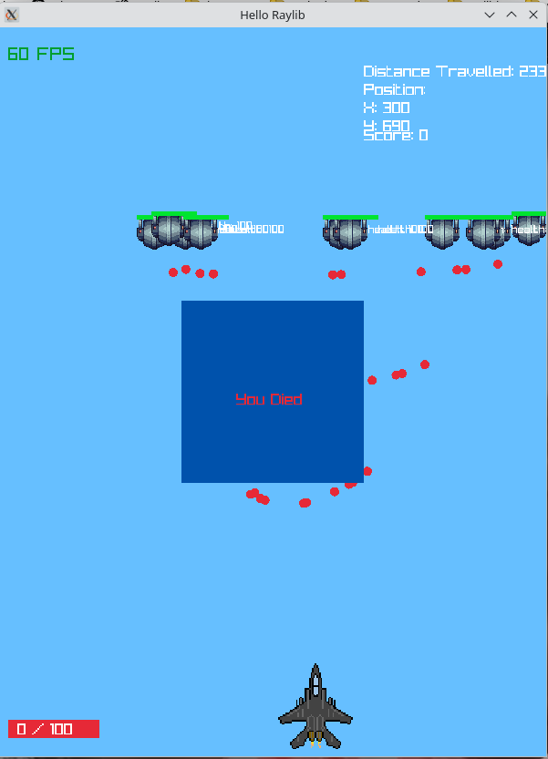
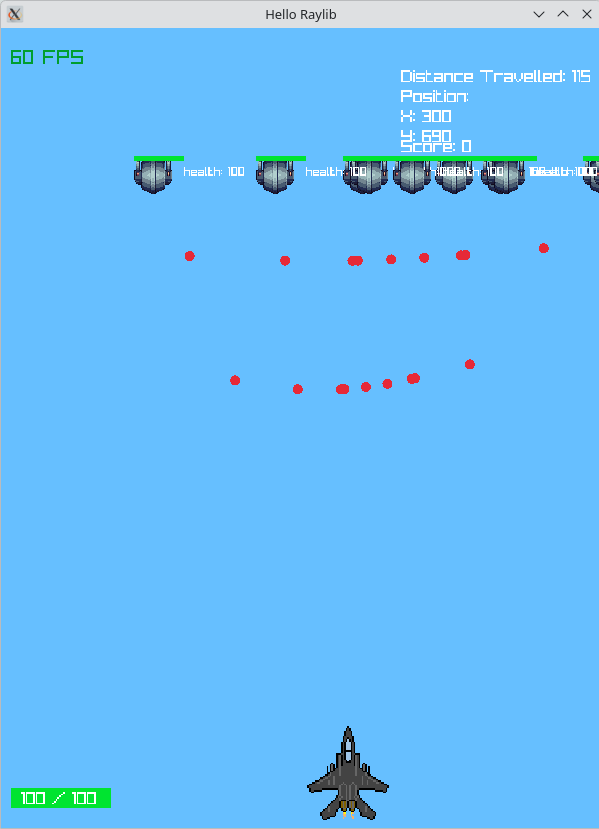

# Basic shootem up game in raylib

last updated: November 10, 2024

this was made a while ago when I was learning raylib to make games, it isn't the best functioning game but the idea was there: you can move, shoot at enemies, and health system.

To run the game, clone the project. from project root, simply run:

```bash
make
```

### Death

One issue with the game is when you die, there is no restart button, you need to close the game and re-open it again.

### Debugging mode

You can view the hitboxes of the player and enemies by running:

```bash
make debug=true
```

### Unit Test

Unit test was made by myself without a library since it wasn't too complex, to run unit test:

```bash
make test=true
```

### Project Stats

I was bored one afternoon, during this time I discovered `cloc` which is a tool to give you a summary of your project coding languages used. to run:

```bash
make show_project_stats
```

### Controls

WASD - movement
SPACE - shoot

### Screenshots



